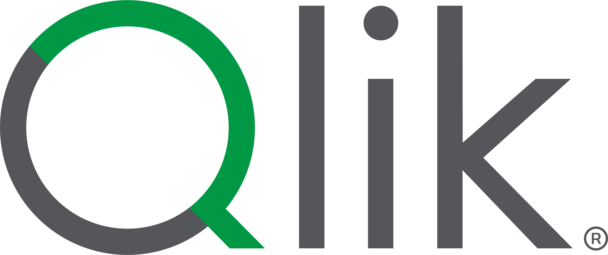

# Qlik AI Assistant — AWS Bedrock + MCP Chat Interface

<p align="center">
  
</p>

<p align="center">
  <strong>Your Friendly Neighborhood AI Assistant</strong><br>
  Chat with your Qlik Cloud data using Claude on AWS Bedrock
</p>

---

A branded web chat application that connects **Qlik Cloud** data to **Anthropic Claude Sonnet 4** via **AWS Bedrock**, using the **Model Context Protocol (MCP)** with **streamable-http** transport and **OAuth PKCE** authentication. Built with [Chainlit](https://docs.chainlit.io), [LangGraph](https://langchain-ai.github.io/langgraph/), and [langchain-mcp-adapters](https://github.com/langchain-ai/langchain-mcp-adapters).

## Architecture

```
┌─────────────────┐     ┌───────────────────────┐     ┌──────────────────┐
│    Browser       │────▶│    Chainlit UI         │────▶│   AWS Bedrock    │
│    (User)        │◀────│    (Python + Qlik CSS) │◀────│   Claude Sonnet 4│
└─────────────────┘     └──────────┬────────────┘     └──────────────────┘
                                   │
                                   │ streamable-http + OAuth PKCE
                                   ▼
                          ┌──────────────────┐
                          │  Qlik Cloud MCP  │
                          │  51 tools        │
                          └──────────────────┘
```

## How It Works

1. **Plug icon** → Enter Qlik Tenant URL + OAuth Client ID → OAuth redirect → Approve → **51 Qlik tools loaded**
2. **Gear icon** → Configure Bedrock API Key, region, model
3. **Ask questions** → Claude calls Qlik MCP tools → returns data from your tenant

## Prerequisites

### AWS Bedrock

1. Go to the [Amazon Bedrock console](https://console.aws.amazon.com/bedrock/home)
2. Navigate to **Model catalog** → search for **Claude**
3. **Submit the Anthropic use case details form** (required for first-time Anthropic model usage)
   - Company name and brief use case description
   - Approval takes ~15 minutes
4. Go to **API keys** in the left sidebar → **Create API key** (short-term or long-term)
5. Copy the API key — it starts with `bedrock-api-key-...`

### Qlik Cloud

1. Your tenant admin goes to **Administration** → **OAuth** → **Create new**
2. **Client type:** Native
3. **Scopes:** `user_default` and `mcp:execute`
4. **Redirect URL:** `http://localhost:8000/auth/qlik/callback`
5. Click **Create** and copy the **Client ID**
6. Share the Client ID with users

Full instructions: [Qlik MCP setup guide](https://help.qlik.com/en-US/cloud-services/Subsystems/Hub/Content/Sense_Hub/QlikMCP/Connecting-Qlik-MCP-server.htm) | [Deploying Qlik MCP](https://help.qlik.com/en-US/cloud-services/Subsystems/Hub/Content/Sense_Hub/QlikMCP/Administering-Qlik-MCP.htm)

## Quick Start

### Local Python

```bash
git clone https://github.com/robertschoenfeldqlik/aws_qlik_mcp_chaintit_chat.git
cd aws_qlik_mcp_chaintit_chat

python -m venv venv
source venv/bin/activate  # Windows: venv\Scripts\activate
pip install -r requirements.txt

cp .env.example .env
# Edit .env with your Bedrock API key and Qlik tenant URL

chainlit run app.py
```

### Docker

```bash
git clone https://github.com/robertschoenfeldqlik/aws_qlik_mcp_chaintit_chat.git
cd aws_qlik_mcp_chaintit_chat

cp .env.example .env
# Edit .env

docker compose up --build
```

Open [http://localhost:8000](http://localhost:8000).

## Configuration

### Environment Variables (`.env`)

| Variable | Required | Description |
|---|---|---|
| `AWS_BEARER_TOKEN_BEDROCK` | Yes | Bedrock API key from console > API keys |
| `AWS_DEFAULT_REGION` | No | Region matching your API key (default: `us-east-1`) |
| `QLIK_TENANT_URL` | No | Pre-fills the Qlik connection form |
| `QLIK_OAUTH_CLIENT_ID` | No | Pre-fills the OAuth Client ID |
| `APP_BASE_URL` | No | Base URL for OAuth callback (default: `http://localhost:8000`) |
| `LOG_LEVEL` | No | DEBUG, INFO, WARNING, ERROR (default: `INFO`) |

### Gear Icon (Settings Panel)

| Setting | Default | Description |
|---|---|---|
| **Bedrock API Key** | From env | Bedrock API key |
| **AWS Region** | us-east-1 | Must match API key region |
| **Bedrock Model** | Claude 4 Sonnet | Claude 4 Sonnet, Amazon Nova Pro, Meta Llama 3.3 70B |
| **Temperature** | 0.2 | Lower = more deterministic tool calling |
| **Max Tokens** | 4096 | Response length limit |

### Plug Icon (Qlik MCP Connection)

The plug icon opens a Qlik-branded form:
- **Qlik Tenant URL** — `https://your-tenant.us.qlikcloud.com`
- **OAuth Client ID** — from your Qlik admin

Click **Connect** → redirects to Qlik Cloud OAuth → sign in → approve → **51 tools loaded**.

The OAuth flow uses **Authorization Code + PKCE (S256)** via the `streamable-http` MCP transport.

## Qlik MCP Connection Details

| Parameter | Value |
|---|---|
| **Transport** | `streamable-http` |
| **MCP URL** | `https://<tenant>/api/ai/mcp` |
| **Header** | `X-Agent-Id: <oauth-client-id>` |
| **Auth Header** | `Authorization: Bearer <oauth-token>` |
| **OAuth Authorize** | `https://<tenant>/oauth/authorize` |
| **OAuth Token** | `https://<tenant>/oauth/token` |
| **Scopes** | `user_default mcp:execute` |
| **PKCE** | S256 code challenge |
| **Grant Types** | `authorization_code`, `refresh_token` |
| **Client Secret** | None (native/public client) |

## 51 Available Qlik MCP Tools

| Category | Tools |
|---|---|
| **Search** | `qlik_search`, `qlik_search_field_values`, `qlik_search_glossary_terms` |
| **Apps** | `qlik_describe_app`, `qlik_list_sheets`, `qlik_create_sheet`, `qlik_get_sheet_details` |
| **Charts** | `qlik_get_chart_info`, `qlik_get_chart_data`, `qlik_add_chart`, `qlik_add_filter` |
| **Dimensions/Measures** | `qlik_list_dimensions`, `qlik_create_dimension`, `qlik_list_measures`, `qlik_create_measure` |
| **Fields/Data** | `qlik_get_fields`, `qlik_get_field_values`, `qlik_create_data_object` |
| **Selections** | `qlik_get_current_selections`, `qlik_select_values`, `qlik_clear_selections` |
| **Datasets** | `qlik_get_dataset`, `qlik_get_dataset_schema`, `qlik_get_dataset_profile`, `qlik_get_dataset_sample`, `qlik_get_dataset_trust_score`, `qlik_get_lineage`, `qlik_update_dataset_metadata`, `qlik_update_dataset_quality`, `qlik_get_dataset_memberships`, `qlik_get_dataset_quality_computation_status`, `qlik_get_dataset_freshness` |
| **Data Products** | `qlik_create_data_product`, `qlik_update_data_product`, `qlik_delete_data_product`, `qlik_get_data_product`, `qlik_get_data_product_documentation`, `qlik_update_data_product_space`, `qlik_update_activate_data_product`, `qlik_update_deactivate_data_product` |
| **Glossary** | `qlik_create_glossary`, `qlik_create_glossary_term`, `qlik_update_glossary_term`, `qlik_delete_glossary_term`, `qlik_get_glossary_term`, `qlik_get_glossary_categories`, `qlik_get_glossary_term_links`, `qlik_create_glossary_term_links`, `qlik_update_term_status`, `qlik_create_glossary_category`, `qlik_get_full_glossary_export` |

## Project Structure

```
.
├── app.py                     # Main Chainlit application
├── qlik_oauth.py              # OAuth PKCE flow for Qlik Cloud
├── public/
│   ├── qlik-logo.png          # Qlik logo (transparent background)
│   ├── qlik-mcp.js            # Custom MCP dialog for Qlik
│   └── qlik-theme.css         # Qlik brand CSS
│   └── theme.json             # Chainlit theme (Qlik colors)
├── requirements.txt           # Python dependencies
├── Dockerfile                 # Container build
├── docker-compose.yml         # One-command deployment
├── .env.example               # Environment variable template
├── .chainlit/config.toml      # Chainlit configuration
└── chainlit.md                # In-app readme
```

## Technology Stack

| Component | Technology |
|---|---|
| **Chat UI** | [Chainlit](https://docs.chainlit.io) 2.10+ |
| **LLM** | [AWS Bedrock](https://aws.amazon.com/bedrock/) — Claude Sonnet 4 |
| **Agent** | [LangGraph](https://langchain-ai.github.io/langgraph/) ReAct agent |
| **MCP Bridge** | [langchain-mcp-adapters](https://github.com/langchain-ai/langchain-mcp-adapters) |
| **MCP Transport** | streamable-http with OAuth PKCE |
| **Data Source** | [Qlik Cloud MCP](https://help.qlik.com/en-US/cloud-services/Subsystems/Hub/Content/Sense_Hub/QlikMCP/Connecting-Qlik-MCP-server.htm) — 51 tools |
| **Theming** | Qlik brand colors + Source Sans 3 font |

## Troubleshooting

### "Model use case details have not been submitted"
Submit the Anthropic use case form in the Bedrock console under Model catalog → Claude. Takes ~15 minutes to approve.

### MCP connection fails with "unhandled errors in a TaskGroup"
The MCP SSE transport doesn't work with Qlik — use `streamable-http`. This is handled automatically by the plug icon form.

### Claude lists tools but doesn't call them
Lower the temperature to 0.2 in Settings. The system prompt is tuned for tool calling.

### OAuth callback fails
Verify `http://localhost:8000/auth/qlik/callback` is registered as a redirect URL in your Qlik OAuth client configuration.

### Bedrock API key expired
Generate a new key from Bedrock console → API keys. Short-term keys last up to 12 hours.

## License

See [LICENSE](LICENSE) for details.
